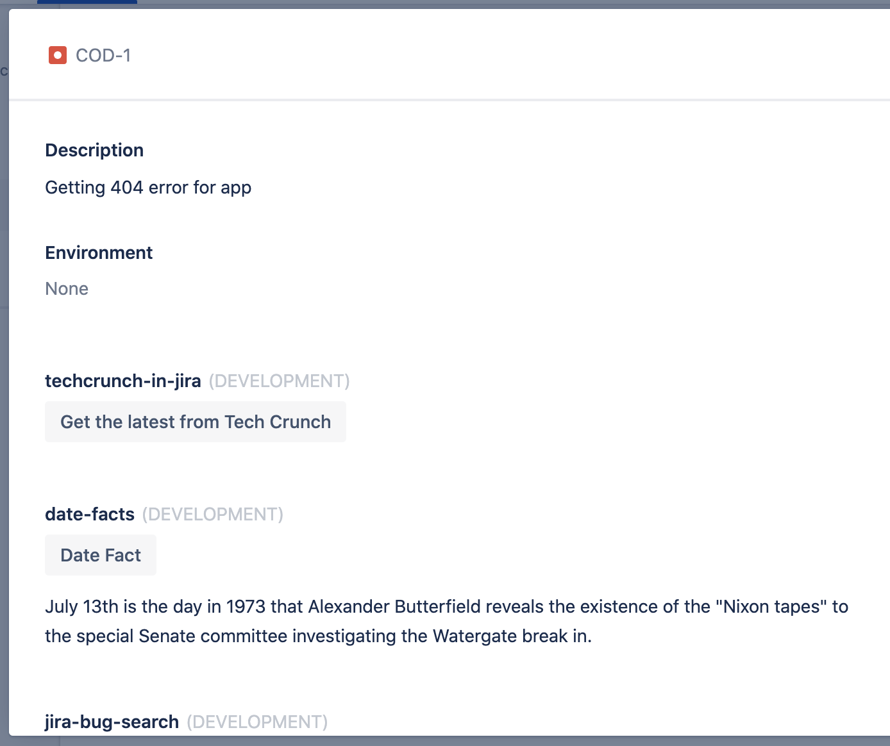

# Date Fact

This project contains a Forge app written in Javascript that gets a fact about that particular month and day and displays it in a JIRA issue panel. 

## Requirements

See [Set up Forge](https://developer.atlassian.com/platform/forge/set-up-forge/) for instructions to get set up.

## Quick start

- Clone this repo

- Register this application on your site using:
```
forge register
```

- Install node modules:
```
npm install
```

- Build and deploy your app by running:
```
forge deploy
```

- Install your app in an Atlassian site by running:
```
forge install
```

- Develop your app by running `forge tunnel` to proxy invocations locally:
```
forge tunnel
```

## Demo

 
